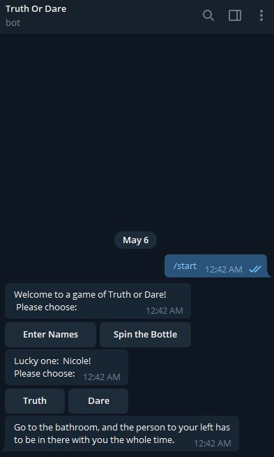

# telegram_chatbot
This Truth or Dare telegram bot can (1) randomly select a player and (2) pick a truth/dare question based on the player's selection. 

**Here are my learnings:**  
I am a beginner and wanted to learn through a hands-on project. Please feel free to provide your feedback!

Issue #1 - How to get the response value from a markup keyboard?  
Initially, I experimented with ReplyKeyboardMarkup but I could not retrieve the value. With further research, I learnt that using InlineKeyboard was a better choices as it offers a CallbackQuery method which allowed retrieval of response value. 

Issue #2 - How to establish a process flow? For example, the first markup keyboard will prompt for the selection of action. If action == Spin the Bottle, the second markup keyboard will prompt for the selection of Truth or Dare. The keyboards were appearing at the same time.   
I made use of ConversationHandler to handle the different states of a conversation: https://python-telegram-bot.readthedocs.io/en/stable/telegram.ext.conversationhandler.html

**Resources used**  
Fantastic Guide by tbhaxor - https://github.com/guides-to/BUILDING-TELEGRAM-BOT-IN-PYTHON  
Truth or Dare Qns - Scrapped from https://improb.com/best-truth-or-dare-questions/  
Handling multiple callback queries with conversation builder - https://stackoverflow.com/questions/41195822/multiple-callback-query-handlers
If you want to deploy this, you can use https://www.pythonanywhere.com/
